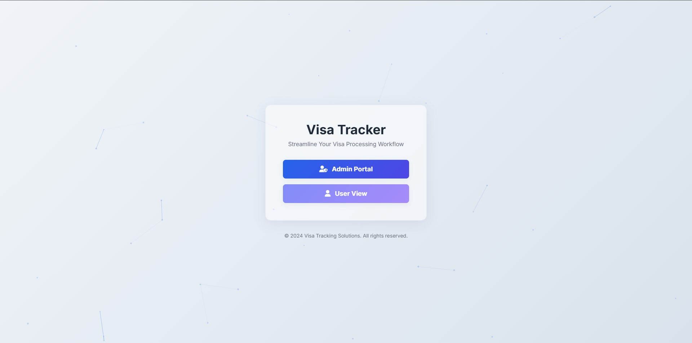
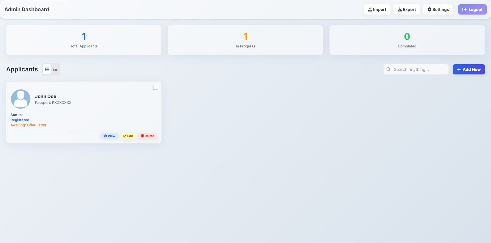

# Freelance Visa Tracker (Self-Hosted)

A simple, modern, and self-hosted web application to track the progress of freelance visa applications. Designed for small agencies or individuals managing multiple applicants, it provides a clean, user-friendly interface with both admin and user views.

 

## Features

* **Secure & Private:** Self-hosted design means all your data stays on your server.
* **Dual User Roles:**
    * **Admin View:** Full CRUD (Create, Read, Update, Delete) access to applicant data, settings configuration, and progress tracking.
    * **User View:** A read-only interface for clients or team members to view applicant status without being able to make changes.
* **Dynamic Applicant Views:** Toggle between a responsive grid view and a detailed list view to see your applicants.
* **Comprehensive Applicant Profiles:** Store essential information including name, passport number, file number, UID, contact details, and nationality.
* **Customizable Visa Process:**
    * Define your own visa processing steps in the settings.
    * Easily reorder steps with a drag-and-drop interface.
* **Document Management:**
    * Upload applicant photos and other necessary documents directly to their profile.
    * View and download uploaded files at any time.
* **Real-time Progress Tracking:**
    * Mark visa steps as complete for each applicant.
    * The system automatically highlights the current "awaiting" step.
* **Data Management:**
    * **Export:** Export all or selected applicant data as a `.json` backup file or a `.zip` archive containing a text summary and all documents.
    * **Import:** Restore your application's state from a `.json` backup file with a single click.
* **Search & Filter:** Instantly search for any applicant by name, passport number, file number, or UID.
* **Secure Admin Access:** Password-protected admin portal with an idle-session timeout for enhanced security.
* **Modern UI:** A clean, responsive, and visually appealing interface built with Tailwind CSS, featuring glass-effect styling and smooth animations.

## Tech Stack

* **Frontend:** HTML, Tailwind CSS, Vanilla JavaScript
* **Backend:** Node.js, Express.js
* **File Storage:** Local file system
* **Dependencies:** Multer (for file uploads), Archiver (for zipping files)

## Getting Started

### Prerequisites

* A machine (like a Debian server or a local computer) with [Node.js](https://nodejs.org/) (v14 or higher recommended) and `npm` installed.

### Installation

1.  **Clone the repository or download the files:**
    ```bash
    git clone [https://github.com/mo-omen/FVT-Self-Hosted.git](https://github.com/mo-omen/FVT-Self-Hosted.git)
    cd visa-tracker
    ```
    Or, simply place all the project files (`server.js`, `index.html`, `package.json`, etc.) into a single directory on your server.

2.  **Install dependencies:**
    Navigate to the project directory in your terminal and run:
    ```bash
    npm install
    ```
    This will install Express, CORS, Multer, and Archiver.

3.  **Start the server:**
    ```bash
    node server.js
    ```
    By default, the server will start on port `4087`. You should see the message: `Visa Tracker server listening on port 4087`.

4.  **Access the Application:**
    Open your web browser and navigate to `http://<your-server-ip>:4087`. If you are running it locally, go to `http://localhost:4087`.

### Initial Setup

* The first time you run the server, it will automatically create a `data` directory (for `.json` database files) and an `uploads` directory (for documents).
* The default admin password is `password123`. It is **highly recommended** to change this immediately after your first login via the **Settings** panel.

## How to Use

### Admin Portal

1.  Click the "Admin Portal" button on the main page.
2.  Enter the admin password (`password123` by default) to log in.
3.  **Adding Applicants:** Click the "Add New" button and fill out the form.
4.  **Managing Applicants:**
    * Click "View" to see an applicant's detailed progress and manage their documents.
    * Click "Edit" to update an applicant's information.
    * Click "Delete" to remove an applicant.
5.  **Tracking Progress:** In the applicant detail view, you can mark steps as complete or undo them.
6.  **Settings:** Click the cog icon to access the settings menu where you can change the admin password and customize the visa process steps.
7.  **Import/Export:** Use the "Import" and "Export" buttons in the header to manage your application data.

### User View

1.  Click the "User View" button on the main page.
2.  This portal is read-only. You can search for applicants and view their progress, but you cannot make any changes.

### Screenshots

Here is a look at the application's interface.

**Login Page:**


**Admin Dashboard:**


## License

This project is open-source and available under the MIT License.
